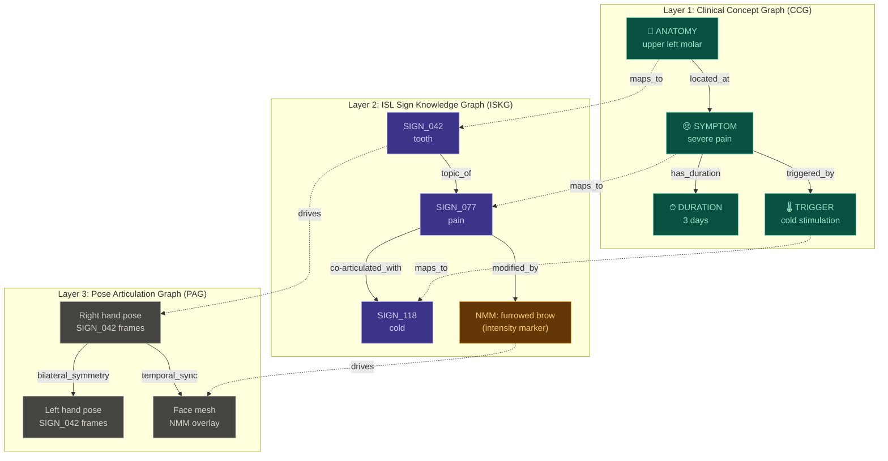

# Graph-Based Architecture for ISL Reverse Translation

## Why Graphs? — The Structural Argument

The current reverse translation pipeline is **strictly sequential**: M1 → M2 → M3 → M4 → M5. Each module passes a flat data structure (list of strings, list of SIGN_IDs) to the next. This creates three fundamental problems:

| Problem | Current Pipeline | Graph Solution |
|---------|-----------------|----------------|
| **Information loss at boundaries** | M1 extracts rich NER + dependency structure, but passes only flat entity lists downstream. M3 maps concepts independently — "tooth" and "infected" are mapped without knowing they're related. | Graph preserves all relationships as edges. Every downstream module sees the full relational structure. |
| **ISL is not sequential** | M4 reorders signs into a linear sequence, but ISL has **simultaneous articulations** — a hand sign with concurrent facial expression, or spatial co-reference where two signs occupy different spatial planes simultaneously. A flat list cannot represent this. | Graph naturally models simultaneity: parallel edges, temporal overlap annotations, and NMM nodes connected to the manual signs they co-occur with. |
| **Rule-based grammar is brittle** | M4's 7 hand-coded rules will fail on any sentence structure not anticipated. Adding a new grammar pattern requires manual rule engineering. | GNN learns reordering as a structural transformation on the graph — generalizes to unseen patterns through learned attention over edge types. |

> [!IMPORTANT]
> The core insight: **ISL utterances are not sequences — they are graphs**. A signed sentence has manual signs, non-manual markers, spatial locations, temporal overlaps, and modifier relationships that form a directed graph. Treating the output as a sequence and then bolting NMM flags on as metadata is architecturally backwards. The graph IS the native representation.

---

## Architecture Overview: Heterogeneous Clinical-Sign Graph (HCSG)

The architecture operates on a single **heterogeneous graph** with three interconnected layers. Translation is a **graph-to-graph transformation** — not a sequence of independent mappings.



---

## Layer 1: Clinical Concept Graph (CCG) — Replacing M1 + M2

### What Changes From Current Pipeline
Currently, M1 produces flat NER labels and M2 decomposes Tier-3 terms into concept lists. In the graph approach, **the output of parsing is a graph, not a list**.

### Graph Construction

**Input**: `"Patient has severe pain in upper left molar for 3 days, worsening with cold stimulation"`

**Step 1 — Dependency Parse → Initial Graph**

Use spaCy's dependency parser to construct the syntactic dependency graph of the sentence. Every token becomes a node; every dependency relation becomes a directed edge.

```
          has
         / | \
   Patient  pain  days
             |      |
           severe   3
             |
           molar
           / \
       upper  left
             |
           cold
             |
         stimulation
```

**Step 2 — NER-Typed Node Collapsing**

Merge multi-token entities into single typed nodes using the NER labels (ANATOMY, SYMPTOM, PROCEDURE, INSTRUCTION, SEVERITY, DURATION, TRIGGER):

| Node | Type | Original tokens |
|------|------|----------------|
| `upper_left_molar` | ANATOMY | "upper left molar" |
| `severe_pain` | SYMPTOM | "severe pain" |
| `3_days` | DURATION | "3 days" |
| `cold_stimulation` | TRIGGER | "cold stimulation" |
| `worsening` | SEVERITY_MOD | "worsening" |

**Step 3 — Semantic Edge Construction**

Replace syntactic edges with semantic clinical relationship edges:

| Edge Type | Meaning | Example |
|-----------|---------|---------|
| `LOCATED_AT` | Symptom is at anatomy site | severe_pain → upper_left_molar |
| `HAS_DURATION` | Temporal extent | severe_pain → 3_days |
| `TRIGGERED_BY` | Causal trigger | severe_pain → cold_stimulation |
| `MODIFIED_BY` | Severity/quality modifier | severe_pain → worsening |
| `PART_OF` | Anatomical hierarchy | upper_left_molar → jaw (from ontology) |
| `PRECEDES` | Temporal ordering in clinical note | (first complaint → second complaint) |

**Step 4 — Tier-3 Subgraph Expansion**

For Tier-3 terms (no direct ISL sign), instead of M2's sequential LLM decomposition, the term is expanded into a **concept subgraph**:

```
root_canal_treatment (PROCEDURE, Tier-3)
        │
    expanded into:
        │
   ┌────┼────────┬─────────┬────────┐
   │    │        │         │        │
 tooth  inside  infected  clean   seal
   │              │
   └──PART_OF─────┘ (inside is part_of tooth)
         │
     infected ──PRECEDES── clean ──PRECEDES── seal
```

The LLM call is used to produce this subgraph structure (with relationship edges), not just a flat list. The key difference: **the decomposition preserves the procedural ordering and part-whole relationships** that M2's flat list discards.

### Node Feature Vectors

Each CCG node carries a feature vector:

```python
node_features = {
    'embedding': BioSentVec(concept_text),     # 700-dim medical embedding
    'entity_type': one_hot(NER_label),          # 7-dim (ANATOMY, SYMPTOM, ...)
    'tier': one_hot(tier_level),                # 3-dim (Tier 1/2/3)
    'position': positional_encoding(order),     # Where in the clinical note
    'is_expanded': bool,                        # Was this LLM-expanded from Tier-3?
}
# Total: ~714 dimensions per node
```

---

## Layer 2: ISL Sign Knowledge Graph (ISKG) — Replacing M3 + M4

> [!TIP]
> This is the most novel component. Instead of separate "mapping" (M3) and "reordering" (M4) modules, the ISKG is a **static knowledge graph** of the entire ISL vocabulary and its linguistic structure. Translation becomes **subgraph selection + activation** on this graph via cross-attention from the CCG.

### Graph Construction (Built Once, Used at Inference)

The ISKG is constructed offline from ISL linguistic knowledge and the 150-sign primitive vocabulary:

#### Node Types

| Node Type | Count | Description | Feature Vector |
|-----------|-------|-------------|---------------|
| **SIGN** | 150 | Manual ISL signs | BioSentVec embedding + handshape params + sign category |
| **NMM** | ~12 | Non-manual markers | NMM type embedding + facial AU codes |
| **LETTER** | 26+ | Fingerspelling alphabet | Letter identity + hand configuration |
| **SPATIAL_LOC** | 5 | Signing space locations | (center, left, right, high, low) |
| **GRAMMAR_ROLE** | 4 | ISL grammar roles | (TOPIC, COMMENT, QUESTION, NEGATION) |

#### Edge Types — The Linguistic Structure

| Edge Type | Connects | What It Encodes | Example |
|-----------|----------|-----------------|---------|
| `SEMANTIC_SIM` | SIGN↔SIGN | Cosine similarity > 0.5 (weighted) | tooth ↔ mouth (0.72) |
| `SYNONYM` | SIGN↔SIGN | Same meaning, different articulation | pain ↔ hurt |
| `ANTONYM` | SIGN↔SIGN | Opposite meaning | clean ↔ dirty |
| `HYPERNYM` | SIGN↔SIGN | Is-a hierarchy | molar → tooth → body_part |
| `CO_OCCURRENCE` | SIGN↔SIGN | Frequently used together (from ISL corpus) | tooth + pain (high) |
| `TOPIC_FOR` | SIGN→GRAMMAR_ROLE | This sign can serve as TOPIC | tooth → TOPIC |
| `REQUIRES_NMM` | SIGN→NMM | This sign needs a non-manual marker | question → raised_brows |
| `MODIFIES` | NMM→SIGN | This NMM modifies the co-occurring sign | head_shake → negate(sign) |
| `SPATIAL_AT` | SIGN→SPATIAL_LOC | Where in signing space | left_tooth → LEFT |
| `TRANSITION_COST` | SIGN↔SIGN | Pose interpolation smoothness (0=smooth, 1=jump cut) | point → wave (0.3) |
| `TEMPORAL_ORDER` | SIGN→SIGN | ISL grammar ordering constraint | TOPIC_sign → COMMENT_sign |

#### Why This Is Powerful

The ISKG encodes M3's vocabulary matching AND M4's grammar rules AND M5's transition smoothness **in a single unified structure**. When a concept from the CCG activates a sign node, the sign's neighborhood in the ISKG already tells you:
- What grammar role it plays (via `TOPIC_FOR` edges)
- What NMMs to attach (via `REQUIRES_NMM` edges)
- What order to place it in (via `TEMPORAL_ORDER` edges)
- How smoothly it transitions to neighboring signs (via `TRANSITION_COST` edges)

---

## Layer 3: Pose Articulation Graph (PAG) — Replacing M5

### Each Sign's Pose Is Already a Graph

A sign's pose data (from MediaPipe Holistic) is naturally a skeletal graph:

```
                    nose
                   / | \
            left_eye  |  right_eye
                   mouth
                     |
                   chin
                     |
                  ----+----
                 /    |    \
           left_sh  spine  right_sh
              |              |
          left_elbow    right_elbow
              |              |
          left_wrist    right_wrist
           /  |  \       /  |  \
         [21 left     [21 right
          hand         hand
          joints]      joints]
```

**Nodes**: 75 joints (33 pose + 21L hand + 21R hand)  
**Spatial edges**: Anatomical bone connections (fixed topology)  
**Features per node per frame**: `(x, y, z, visibility, Δx, Δy, Δz)` — 7 features

### Graph-Based Transition Interpolation

Instead of linear lerp across all joints independently (current M5 approach), **graph-based interpolation** uses the skeletal connectivity:

```python
# Current approach (M5): independent per-joint lerp
for joint in all_joints:
    position = lerp(sign_A.last_frame[joint], sign_B.first_frame[joint], t)

# Graph approach: message-passing interpolation
for iteration in range(K):  # K rounds of graph message passing
    for joint in all_joints:
        neighbor_positions = [get_position(n) for n in joint.graph_neighbors]
        position[joint] = weighted_mean(
            lerp_position[joint],           # Self interpolation
            mean(neighbor_positions),        # Neighbor smoothing
            weights=learned_attention        # Attention over skeleton graph
        )
```

This produces **anatomically plausible** intermediate poses — the wrist doesn't interpolate to a position that dislocates the elbow, because the graph constraint propagates skeletal validity through message passing.

### NMM as Concurrent Subgraph Activation

Non-manual markers aren't metadata bolted onto a sign sequence. They are **concurrent activations of the face mesh subgraph**:

```
Sign Timeline:    [SIGN_tooth]───[SIGN_pain]───[SIGN_cold]
                                     │
NMM Timeline:              [furrowed_brow ──────────────]
                            (activates face mesh subgraph
                             with AU4 action unit params)
```

The PAG represents this as a **temporal hypergraph** — each time step has multiple active subgraphs (hand pose + face expression), and the graph structure ensures they're synchronized.

---

## The GNN Architecture: Cross-Graph Attention Translation

### Overview

The translation is a **3-stage graph neural network** that operates across all three graph layers:

```
Stage 1: Encode CCG                    (understand clinical input)
Stage 2: Cross-attend CCG → ISKG       (select and activate signs)
Stage 3: Propagate ISKG → PAG          (generate pose sequence)
```

### Stage 1 — Clinical Graph Encoder (3-layer GAT)

A Graph Attention Network processes the CCG to produce context-aware node embeddings. Each entity understands its role relative to every other entity.

```python
# GAT layer with multi-head attention
class ClinicalGraphEncoder(nn.Module):
    def __init__(self, in_dim=714, hidden=256, heads=4, layers=3):
        self.gat_layers = nn.ModuleList([
            GATv2Conv(
                in_channels=in_dim if i == 0 else hidden * heads,
                out_channels=hidden,
                heads=heads,
                edge_dim=EDGE_TYPE_DIM,   # Edge-type-aware attention
                dropout=0.1
            ) for i in range(layers)
        ])
    
    def forward(self, x, edge_index, edge_attr):
        for gat in self.gat_layers:
            x = gat(x, edge_index, edge_attr)
            x = F.elu(x)
        return x  # Shape: [num_clinical_nodes, hidden * heads]
```

After 3 GAT layers, the node for "severe_pain" has attended to "upper_left_molar" (via `LOCATED_AT` edge), "3_days" (via `HAS_DURATION`), and "cold_stimulation" (via `TRIGGERED_BY`). Its embedding now encodes: *"this is a severe pain, in a specific tooth, lasting 3 days, triggered by cold"* — all in a single vector.

### Stage 2 — Cross-Graph Attention (CCG → ISKG)

This is the core translation step. Each CCG node attends to ALL ISKG sign nodes to compute **activation scores**:

```python
class CrossGraphAttention(nn.Module):
    """
    Each clinical concept node attends to sign nodes in the ISKG.
    Produces soft sign activation scores.
    """
    def __init__(self, clinical_dim, sign_dim, heads=8):
        self.W_q = nn.Linear(clinical_dim, sign_dim * heads)   # Clinical → query
        self.W_k = nn.Linear(sign_dim, sign_dim * heads)       # Sign → key  
        self.W_v = nn.Linear(sign_dim, sign_dim * heads)       # Sign → value
        self.heads = heads
    
    def forward(self, clinical_embeddings, sign_embeddings):
        # clinical_embeddings: [N_clinical, clinical_dim]
        # sign_embeddings:     [N_signs, sign_dim]  (150 signs + NMMs + letters)
        
        Q = self.W_q(clinical_embeddings)   # [N_clinical, sign_dim * heads]
        K = self.W_k(sign_embeddings)       # [N_signs, sign_dim * heads]
        V = self.W_v(sign_embeddings)       # [N_signs, sign_dim * heads]
        
        # Multi-head attention scores
        attention = (Q @ K.T) / sqrt(sign_dim)  # [N_clinical, N_signs]
        activation_scores = softmax(attention, dim=-1)
        
        # Activated sign representations
        activated_signs = activation_scores @ V  # [N_clinical, sign_dim * heads]
        
        return activation_scores, activated_signs
```

**What this produces**: For each clinical concept, a probability distribution over all 150 signs. "severe_pain" might activate SIGN_077 (pain) with 0.85, SIGN_042 (hurt) with 0.10, and spread 0.05 across others.

### Stage 2b — Graph-Constrained Sign Selection

Raw attention scores are refined by propagating through the ISKG's structure:

```python
class ISKGRefinement(nn.Module):
    """
    Propagate activation scores through the ISKG to enforce
    linguistic constraints (grammar, NMM, co-occurrence).
    """
    def __init__(self):
        self.gat = GATv2Conv(...)  # GAT over ISKG edges
        self.order_predictor = nn.Linear(...)  # Predict temporal position
        self.nmm_predictor = nn.Linear(...)    # Predict NMM activation
    
    def forward(self, sign_activations, iskg_edges):
        # 1. Propagate activations through ISKG
        refined = self.gat(sign_activations, iskg_edges)
        
        # 2. ISKG topology enforces grammar:
        #    - TOPIC_FOR edges boost anatomy signs to first position
        #    - REQUIRES_NMM edges activate NMM nodes when their sign is active
        #    - CO_OCCURRENCE edges boost signs that commonly pair together
        #    - TEMPORAL_ORDER edges determine output sequence
        
        # 3. Predict ordering from refined activations
        positions = self.order_predictor(refined)  # [N_activated, 1] — scalar position
        nmm_flags = self.nmm_predictor(refined)    # [N_activated, N_nmm_types]
        
        return refined, positions, nmm_flags
```

> [!IMPORTANT]
> **This replaces M3 AND M4 in a single learned operation.** The ISKG's `TOPIC_FOR` edges learn to push anatomy signs to the front (topic position) — this is M4's Rule 1, but learned not hand-coded. The `REQUIRES_NMM` edges learn that question-words trigger `raised_brows` — this is M4's NMM flagging, but as graph structure not if-else logic. The `SEMANTIC_SIM` edges handle M3's synonym resolution. All unified.

### Stage 3 — Pose Sequence Generation (ISKG → PAG)

The activated and ordered sign nodes drive the pose generation:

```python
class PoseGraphGenerator(nn.Module):
    def __init__(self):
        self.sign_to_pose = nn.Linear(sign_dim, pose_dim)
        self.transition_gnn = GATv2Conv(...)  # Over skeletal graph
        self.nmm_to_face = nn.Linear(nmm_dim, face_au_dim)
    
    def forward(self, ordered_signs, nmm_flags, pose_database):
        frames = []
        for i, sign in enumerate(ordered_signs):
            # 1. Look up base pose sequence from database
            base_poses = pose_database[sign.id]  # [T, 75, 7]
            
            # 2. If transition needed, use graph-based interpolation
            if i > 0:
                transition = self.graph_interpolate(
                    prev_sign_last_frame,
                    base_poses[0],
                    skeleton_graph,
                    n_frames=8
                )
                frames.extend(transition)
            
            # 3. Apply NMM overlays to face mesh subgraph
            if nmm_flags[i].any():
                base_poses = self.apply_nmm(base_poses, nmm_flags[i])
            
            frames.extend(base_poses)
        
        return frames  # Full pose sequence for rendering
```

---

## Worked Example: End-to-End

**Doctor types**: `"pt c/o severe pain UL6 since 3d, worsening on cold"`

### Step 1: CCG Construction

```
┌─────────────────────┐     LOCATED_AT      ┌──────────────────┐
│ SYMPTOM             │────────────────────→│ ANATOMY          │
│ severe_pain         │                      │ upper_left_molar │
│ embed: [0.23, ...]  │                      │ embed: [0.87,...]│
│ tier: 1             │                      │ tier: 1          │
└─────────┬───────────┘                      └──────────────────┘
          │ HAS_DURATION        TRIGGERED_BY          ▲
          ▼                          │                │
┌─────────────────┐                  │         MODIFIED_BY
│ DURATION        │                  │                │
│ 3_days          │                  │     ┌──────────────────┐
│ embed: [0.45,.] │                  └────→│ TRIGGER          │
│ tier: 1         │                        │ cold_stimulation │
└─────────────────┘                        │ embed: [0.61,...]│
                                           │ tier: 1          │
   ┌──────────────────┐                    └──────────────────┘
   │ SEVERITY_MOD     │
   │ worsening        │
   │ embed: [0.33,...]│
   └──────────────────┘
```

### Step 2: GAT Encodes CCG

After 3 GAT layers, each node's embedding now encodes its full clinical context. `severe_pain`'s embedding has attended to its anatomy location, duration, trigger, and severity modifier.

### Step 3: Cross-Attention → ISKG Activation

| CCG Node | Top Activated Signs | Score | NMM Triggered |
|----------|-------------------|-------|---------------|
| upper_left_molar | SIGN_042 (tooth) | 0.91 | — |
| upper_left_molar | SIGN_LEFT (spatial) | 0.78 | — |
| severe_pain | SIGN_077 (pain) | 0.88 | furrowed_brow (intensity) |
| worsening | — | — | forward_lean (emphasis) |
| 3_days | SIGN_031 (3) + SIGN_095 (day) | 0.82 | — |
| cold_stimulation | SIGN_118 (cold) | 0.85 | — |

### Step 4: ISKG Propagation → Grammar Ordering

The ISKG's topology reorders the activated signs:

```
Before ISKG propagation (English order):
  severe_pain → upper_left_molar → 3_days → cold_stimulation

After ISKG propagation (ISL topic-comment order):
  SIGN_042(tooth) [TOPIC] → SIGN_LEFT(spatial) →
  SIGN_077(pain) [+furrowed_brow] → SIGN_118(cold) [TRIGGER] →
  SIGN_031(3) → SIGN_095(day)

  [Headshake suppressed — no negation detected]
  [Forward lean at SIGN_077 — emphasis on pain severity]
```

### Step 5: PAG → Pose Sequence

The ordered sign list drives pose lookup + graph-based interpolation + NMM facial overlays → smooth avatar animation.

---

## Comparison: Current Pipeline vs Graph Architecture

| Dimension | Current Sequential (M1→M5) | Graph-Based (HCSG) |
|-----------|---------------------------|-------------------|
| **Information flow** | Lossy — each module sees only its predecessor's output | Lossless — all modules operate on shared graph; clinical context preserved to rendering |
| **Concept mapping** | Independent per-concept (M3 maps each word separately) | Context-aware — "pain" maps differently when the graph shows it's dental vs. general |
| **Grammar** | 7 hand-coded rules (brittle) | Learned from ISKG topology + training data (generalizable) |
| **NMM handling** | Metadata flags bolted on post-hoc | First-class graph nodes with learned activation |
| **Simultaneity** | Cannot represent — output is a flat sequence | Natural — concurrent subgraph activations |
| **Sign transitions** | Linear lerp per joint (can produce impossible poses) | Graph-constrained interpolation (anatomically plausible) |
| **New sign addition** | Add to vocabulary JSON + update M3 embeddings + add M4 rules | Add node + edges to ISKG (relationships encode grammar automatically) |
| **Interpretability** | Opaque per-module decisions | Attention weights over graph edges show exactly why each sign was selected and placed |
| **Error propagation** | M1 NER error → M3 wrong sign → M4 wrong order (cascading) | Single end-to-end model; errors don't cascade through module boundaries |

---

## Training Strategy

### Data Requirements

| Data | Source | Purpose |
|------|--------|---------|
| Clinical sentence → ISL sign sequence pairs | ISL expert annotation sessions (target: 500 pairs) | Supervised training for CCG→ISKG mapping |
| ISL grammar ordering examples | ISL expert + Vasishta et al. reference | Edge supervision for ISKG ordering edges |
| NMM co-occurrence data | ISL video corpus annotation | NMM activation labels |
| ISKG structure | Expert-constructed + BioSentVec similarity | Static graph, built once |
| Pose data per sign | MediaPipe extraction from sign videos | PAG construction |

### Training Phases

**Phase 1 — ISKG Pre-construction** (no training needed)
- Build the 150-sign knowledge graph with all edge types
- Compute BioSentVec embeddings for all signs
- Extract MediaPipe poses for all sign videos
- This is manual/semi-automated — ~2 weeks of expert time

**Phase 2 — CCG Encoder Pre-training** (self-supervised)
- Train the GAT on clinical text graphs using masked node prediction
- Dataset: i2b2 clinical notes + dental clinical notes
- The encoder learns clinical entity relationships without ISL labels

**Phase 3 — Cross-Attention Fine-tuning** (supervised)
- Train CCG→ISKG cross-attention on expert-annotated (sentence, sign_sequence) pairs
- Loss function: combination of
  - **Sign selection loss** (binary cross-entropy per sign node)
  - **Ordering loss** (pairwise ranking loss on predicted positions)
  - **NMM activation loss** (binary cross-entropy per NMM type)
  - **ISKG structure regularization** (encourage predictions consistent with ISKG edge types)

**Phase 4 — PAG Transition Fine-tuning** (self-supervised)
- Train graph-based interpolation on pairs of consecutive signs
- Loss: reconstruction of held-out intermediate frames from sign transition videos
- Additional loss: skeletal validity (bone lengths preserved, no joint penetration)

### Edge-Deployability

The trained model is:
1. ISKG is a static graph stored as sparse adjacency matrices — small memory footprint
2. GAT inference is matrix multiplication — ONNX-exportable
3. Cross-attention is standard transformer attention — OpenVINO compatible
4. **Total model size estimate**: ~15MB (comparable to current M3+M4 combined)

---

## Publishability Analysis

| Component | Novelty | Publishable? |
|-----------|---------|-------------|
| **Heterogeneous Clinical-Sign Graph formulation** | Novel graph representation for text-to-sign translation; no prior work formulates ISL translation as heterogeneous graph transformation | ✅ **Core contribution** — the formulation itself is the paper |
| **Cross-graph attention for sign selection** | Adapts cross-attention from NMT to graph-to-graph translation in sign language domain | ✅ **Core contribution** — unified mapping + reordering |
| **ISKG as linguistic knowledge graph** | Novel ISL vocabulary graph encoding grammar, co-occurrence, and transition costs | ✅ **Core contribution** — reusable ISL resource |
| **Graph-based pose interpolation** | Skeletal graph constraint for sign transitions (vs. naive lerp) | ✅ Supporting contribution |
| **CCG construction from clinical text** | Straightforward application of dependency parsing + NER | ❌ Pipeline component, not novel |

> [!TIP]
> This architecture could yield **2 papers**: (1) the HCSG formulation + cross-graph attention translation, and (2) the ISKG as a reusable ISL linguistic resource with graph-based grammar encoding.

---

## Literature Grounding — Why This Is Timely

Recent literature (2022–2026) strongly validates this direction while revealing a critical gap that this architecture fills:

### Directly Supporting Work

| Paper/System | Venue | What It Does | How It Validates Our Approach |
|---|---|---|---|
| **ASLKG** (Kezar et al.) | ACL Findings 2024 | Knowledge graph of 5,802 ASL signs with 71K+ phonological + semantic edges | Proves sign language KGs are effective inductive priors for data-scarce tasks. **No ISL equivalent exists** — our ISKG would be the first. |
| **SignFormer-GCN** | NeurIPS 2025 | Joint Transformer + ST-GCN for sign language translation; GCN captures skeleton dependencies, Transformer handles temporal context | Validates GAT-over-skeleton as the right architecture for sign representation. We extend this to the *generation* direction. |
| **SignAvatars** | ECCV 2024 | 70K+ clips with SMPL-X parameterization; graph-structured latent space for 3D sign motion | Validates skeletal graph as the natural representation for sign pose generation (our PAG layer). |
| **Sign-D2C** (Discrete-to-Continuous) | CVPR 2024 | Diffusion model for coarticulation — generates smooth transitions between discrete signs via masked graph segments | Directly addresses our transition interpolation problem; validates graph-based approach over naive lerp. |
| **SGSA** (Skeletal Graph Self-Attention) | ACL 2024 | Graph-enhanced self-attention over spatio-temporal skeletal adjacency for pose generation | Validates that "skeleton inductive bias" in attention layers produces more physically plausible poses. |
| **GAT + Dependency Trees for Syntax Transfer** | Neurosymbolic AI 2024 | GAT over syntactic parse trees integrated with BERT for language pairs with divergent word order | Directly validates our CCG→ISKG cross-attention for handling English SVO → ISL topic-comment reordering. |
| **MM-HGNN** (Multimodal Heterogeneous GNN) | 2025 | Heterogeneous graph with different node types per modality + modality-level attention | Validates our heterogeneous graph approach (clinical nodes, sign nodes, pose nodes as different types with cross-modal edges). |

### The Gap We Fill

> [!IMPORTANT]
> **No published work exists on graph-based ISL production (text → sign).** All ISL graph work is recognition-only (sign → text). All sign language production work uses ASL/DGS, not ISL. And no graph-to-graph translation approach has been applied to any sign language production task. This architecture sits at the intersection of three active research frontiers:
> 1. **Knowledge-graph-guided sign translation** (only ASLKG for ASL, nothing for ISL)
> 2. **Graph neural networks for sign production** (only recognition so far)
> 3. **Heterogeneous graph translation for clinical NLP** (no sign language application)

### Additional Relevant Architecture Decisions

- **Sign-IDD** (AAAI 2025) uses 4D bone representation (3D direction + 1D distance) as graph edges — we could adopt this for our PAG edge features instead of raw joint coordinates
- **GSM++** (ICML 2025) tokenizes graphs into sequences via hierarchical clustering — relevant if we need to export the graph model to sequence-based inference for edge deployment
- **HiGPT** (2024) demonstrates zero-shot generalization across heterogeneous graph types — could inform how we handle unseen clinical input structures

---

## Open Questions

> [!WARNING]
> **Data scale concern**: The cross-attention requires supervised (sentence → sign_sequence) pairs. With only 150 signs and dental-domain scope, is 500 annotated pairs sufficient for a GAT, or would this need to start with the rule-based approach and distill into the GNN later?

> [!IMPORTANT]
> **Hybrid approach worth considering**: Start with the rule-based M4 grammar engine (already specified), but encode its rules as ISKG edges. Use the rule-based output as "silver standard" training data for the GNN. Once the GNN is trained, it can generalize beyond the hand-coded rules. This gives you a working system immediately + a research contribution pathway.

1. **Do you want to pursue the full end-to-end graph approach, or a hybrid (rule-based ISKG construction + GNN refinement)?**
2. **For the ISKG construction — do you have access to an ISL linguist who can annotate grammar edges, or should we derive them algorithmically from ISL video corpora?**
3. **Should the Pose Articulation Graph (Layer 3) be graph-based from the start, or keep the current Stage A (ffmpeg stitching) for prototyping and only graph-ify Stage B?**
